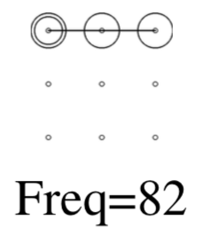

# Unlock Patterns

Based heavily from Mr. Adam Aviv's research.

## TL;DR
The best approach to securing your device is to use the longest PIN you are comforatable with and the shortest lock out time you can stand.

It has been found that around 64% of the online test subjects could reproduce a six-point pattern after one viewing, and 80% after two. Only 11% could identify a six-digit PIN after one viewing, and 27 percent after two. Turing off the pattern visibility reduced attack success rate down to 35% for single viewings and 52% with multiple views.

## Good

* Turn off 'make pattern visible'.
* Use a crossover in your pattern.

## Bad

* Try not to use use letters.
* Try not to use a symmetric pattern.
* Try not to start from the corners.

## Directory Structure
Path
* \<researcher\>\\<matrix\>/\<report-type\>/\<type\>.json

Examples
* aviv/3x3/pen-and-paper/tri-grams.json
* aviv/3x3/pen-and-paper/patterns.json
* aviv/4x4/self-reported/quad-grams.json

### Researcher

At this time there is only Mr.Adam Aviv.

### Matrix

* 3x3
* 4x4

### Report Types

This stems from the approach taken by Mr. Aviv in his research paper.

* pen-and-paper: Test subjects physically drawing a pattern on paper containing a matrix grid.
* self-reported: Test subjects reporting their own pattern through an online interface.

### Types

* tri-grams
* quad-grams (only for 4x4+ grids)
* patterns

## JSON Format

```json
{
    "patterns": [
        {
            "nodes": [
                0,
                1,
                2
            ],
            "frequency": 82
        },
        ...
    ]
}
```

### Visual


## Bibliography
Adam Aviv [@adamaviv](https://twitter.com/adamaviv)
* https://www.usna.edu/Users/cs/aviv/papers/aviv-acasc15.pdf
* https://www.usna.edu/Users/cs/aviv/papers/aviv-usec16.pdf

Marte Løge [@MarteLoge](https://twitter.com/MarteLoge)
* https://www.youtube.com/watch?v=6Z5NtzFA7Z8

Articles
* [Ars Technica](https://arstechnica.com/information-technology/2015/08/new-data-uncovers-the-surprising-predictability-of-android-lock-patterns)
* [Wired](https://www.wired.com/story/android-unlock-pattern-or-pin)
