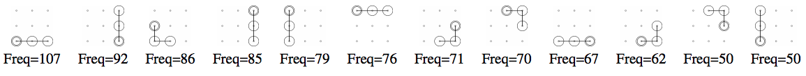
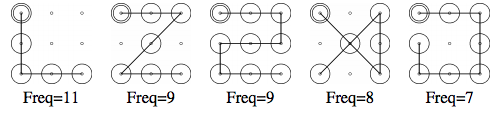
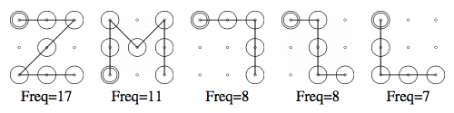

# Unlock Patterns

Target is a 3x3 grid.

## Tri-grams

12 patterns ordered by frequency for each report type.

### Pen and Paper

### Self Reported

## Patterns

5 patterns ordered by frequency for each report type.

### Pen and Paper

### Self Reported

## Bibliography
Adam Aviv [@adamaviv](https://twitter.com/adamaviv)
* https://www.usna.edu/Users/cs/aviv/papers/aviv-acasc15.pdf
* https://www.usna.edu/Users/cs/aviv/papers/aviv-usec16.pdf

Marte Løge [@MarteLoge](https://twitter.com/MarteLoge)
* https://www.youtube.com/watch?v=6Z5NtzFA7Z8
