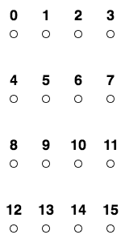
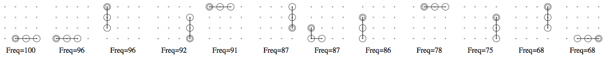
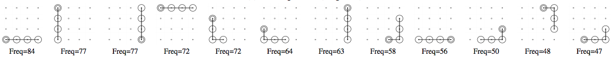
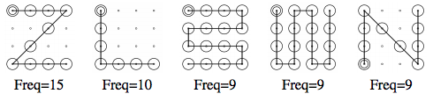

# Unlock Patterns

Target is a 4x4 grid.

## Tri-grams

12 patterns ordered by frequency for each report type.

### Pen and Paper

## Quad-grams

12 patterns ordered by frequency for each report type.

### Pen and Paper

## Patterns

5 patterns ordered by frequency for each report type.

### Pen and Paper

## Bibliography
Adam Aviv [@adamaviv](https://twitter.com/adamaviv)
* https://www.usna.edu/Users/cs/aviv/papers/aviv-acasc15.pdf
